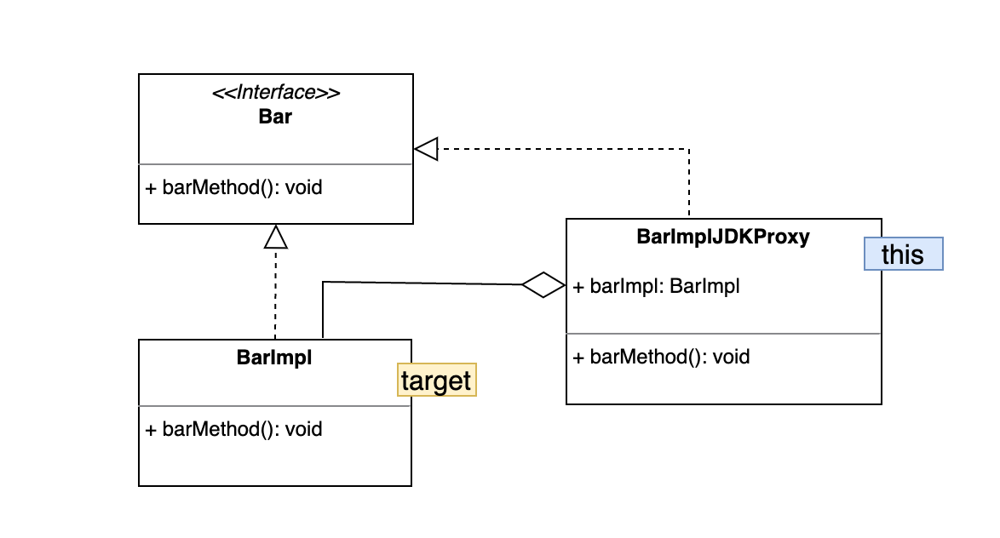
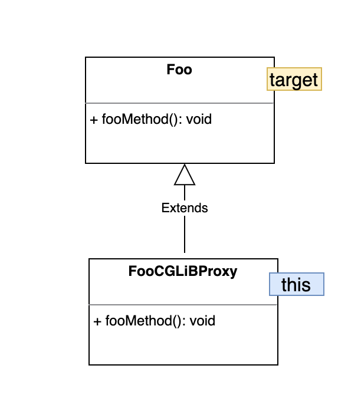

Spring uses JDK proxy when a class implements interface and CGLIB proxy when class don't implement interface.

In this project:

- Spring creates a JDK proxy `BarImplJDKProxy` for `BarImpl` component as it implements `Bar`.

- Spring creates a CGLIB proxy `FooCGLIBProxy` for `Foo` component.

=== Example and explanation of pointcut expression `this(type)`
- `this(com.sample.Bar)`✓
`Here`::
* `this` refers to *JDK proxy* `BarImplJDKProxy`
* `target` is `com.sample.BarImpl`

 Since, 'BarImplJDKProxy' implements 'Bar' which means 'BarImplJDKProxy' is a 'Bar'
 and type defined in the parenthesis of above pointcut expression is `com.sample.Bar` which is a valid type of BarImplJDKProxy ✓.

- `this(com.sample.BarImpl)` ✗
`Here`::
* `this` refers to *JDK proxy* `BarImplJDKProxy`
* `target` is `com.sample.BarImpl`

 'BarImplJDKProxy' is a 'Bar''
 'BarImplJDKProxy' is not a 'BarImpl'
  and type defined in the parenthesis of above pointcut expression is `com.sample.BarImpl`
  which is not a valid type of BarImplJDKProxy ✗.

- `this(com.sample.Foo)` ✗
`Here`::
* `this` refers to *CGLIB proxy* `FooCGLIBProxy`
* `target` is `com.sample.Foo`

 'FooCGLIBProxy' is a 'Foo' - as FooCGLIBProxy extends Foo
 and type defined in the parenthesis of above pointcut expression is `com.sample.Foo` which is a valid type of FooCGLIBProxy ✗.

=== Example and explanation of pointcut expression `target(type)`
- `target(com.sample.Bar)`✓
`Here`::
* `this` refers to *JDK proxy* `BarImplJDKProxy`
* `target` is `com.sample.BarImpl`

 Since, 'BarImpl' implements 'Bar' which means 'BarImpl' is a 'Bar'
 and type defined in the parenthesis of above pointcut expression is `com.sample.Bar` which is a valid type of BarImpl ✓.

- `target(com.sample.BarImpl)`✓
`Here`::
* `this` refers to *JDK proxy* `BarImplJDKProxy`
* `target` is `com.sample.BarImpl`

  It is valid, as type defined in the parenthesis of above pointcut expression is `com.sample.BarImpl` is same as target type ✓.

- `target(com.sample.Foo)`✓
`Here`::
* `this` refers to *CGLIB proxy* `FooCGLIBProxy`
* `target` is `com.sample.Foo`

  It is valid as, type defined in the parenthesis of above pointcut expression is `com.sample.Foo` is same as target type ✓.
